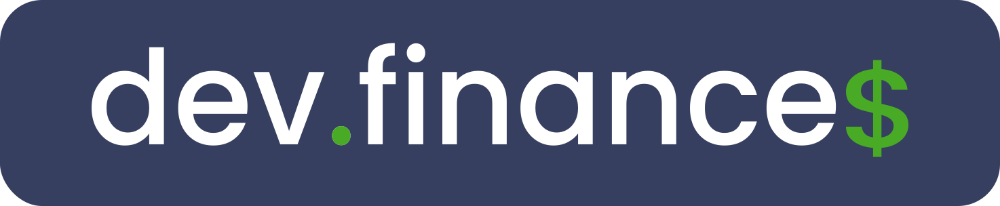
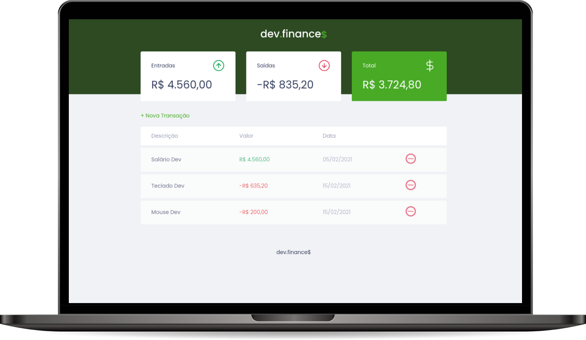
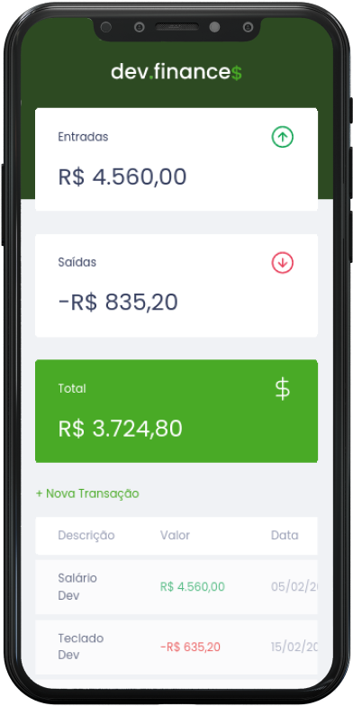

<h1 align="center">
  
</h1>

  <a href="#-tecnologias">Tecnologias</a>&nbsp;&nbsp;&nbsp;|&nbsp;&nbsp;&nbsp;
  <a href="#-projeto">Projeto</a>&nbsp;&nbsp;&nbsp;|&nbsp;&nbsp;&nbsp;
  <a href="#-layout">Layout</a>&nbsp;&nbsp;&nbsp;|&nbsp;&nbsp;&nbsp;
  <a href="#memo-licença">Licença</a>

  

  

  

  
    

## 🚀 Tecnologias

Eu consegui aplicar as seguintes tecnologias neste projeto:

- HTML
- CSS
- JavaScript

## 💻 Projeto

O dev.finances é uma aplicação simples para treinar o HTML, CSS e JavaScript, criada pelo [Mayk Brito](https://github.com/maykbrito) da [Rocketseat](https://github.com/rocketseat-education) no evento [Maratona Discover](https://github.com/rocketseat-education/maratona-discover-01) 💰

## 🔖 Layout

Eles criaram um layout no Figma que você pode verificar através[desse link](https://www.figma.com/file/7Vu9DzUaCZIV4nibzkjgB4/dev.finance%24-Maratona-Discover). É necessário ter conta no [Figma](https://figma.com) para acessá-lo.

## :memo: Licença

Esse projeto está sob a licença MIT. Veja o arquivo [LICENSE](LICENSE) para mais detalhes.

### Autor

---

<a href="https://github.com/cleysonsilvame/" title="Cleyson Silva">
 
  

<b>Cleyson Silva</b> 🚀</a>

👋🏽 Entre em contato!

 
